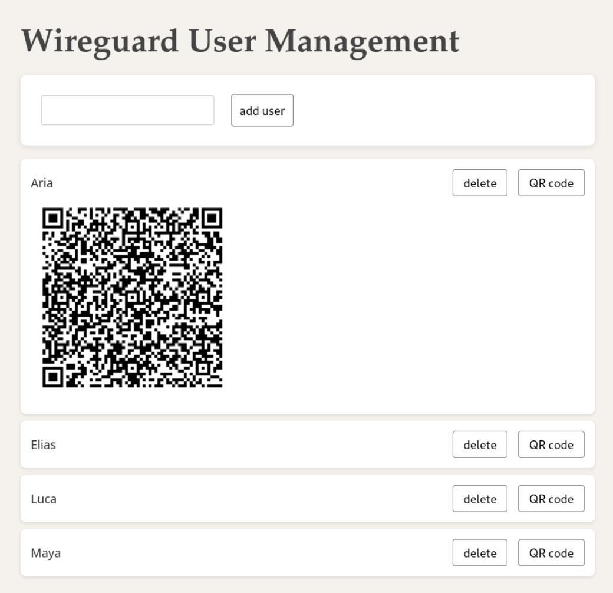

# Simple Wireguard

## Description

This script allows you to setup a Wireguard server via Docker along with a web dashboard for user management.

It uses a modified Wireguard Docker image from [LinuxServer](https://www.gnu.org/licenses/gpl-3.0.html), the Python http.server library and the proxy tool socat.




## Quick Start

Copy the following to your terminal to run this project out of the box:
```
sudo apt update
sudo apt -y install docker.io python3
sudo gpasswd -a $(whoami) docker
git clone https://github.com/n0m1x/simple-wireguard
cd simple-wireguard
docker build --no-cache --pull -t simple-wireguard .
python3 wg-up.py
```
Change the Wireguard IP address in wg-up.py to publish the wireguard server.

By default the web server is only accessible from within the VPN subnet.


## Usage

### Requirements

This project was developed and tested on a debian system. The following packages are required on debian: `docker.io python3`.

Make sure the user you intend to run this script with is in the Docker group (`sudo gpasswd -a $(whoami) docker`) and is permitted to run Docker commands.


### Installation

Download the repository from GitHub and build the docker image:
```
git clone https://github.com/n0m1x/simple-wireguard
cd simple-wireguard
docker build --no-cache --pull -t simple-wireguard .
```
To make the Wireguard service accessible on the internet change the default IP from 127.0.0.1 to the public IP of your server. This will be the IP that Wireguard peers connect to. You can find this and other options directly in the wg-up.py file. Running this file will start the Docker container and the web dashboard.

Start the service with `./wg-up.py`.


### Getting Initial Access

Once the service is running you want to use the VPN and access the web dashboard. The dashboard can be used to add and delete users and show their QR codes to configure a new device. Depending on wether you can access a graphical web browser on your server or not there are two options available to configure the first connection.

If you have access to a GUI and web browser visit http://127.0.0.1 in your browser. You can show the QR code for the `admin` user there which you can use to get an initial connection to the VPN from your mobile or desktop client. You can also open the file config/peer_admin/peer_admin.png with an image viewer to show the QR code or use the config file config/peer_admin/peer_admin.conf. By default, once you are connected you can always access the web dashboard to add more users.

If you cannot access the web dashboard via browser because you do not have desktop environment use `docker logs wireguard`. When the Docker image is started for the first time it prints the QR code to the terminal. Use this initial configuration to connect to the VPN with a mobile or desktop client and add more users by accessing the dashboard under http://wireguard.local in your web browser.


### Configuration

The Wireguard and HTTP server can be configured via the parameters in the beginning of the wg-up.py script. The following options are available.

**Reference Table**

| Option       | Default Value      | Description |
|--------------|-------------------|-------------|
| PROXY        | True              | Set to true to make user management web interface available in the WireGuard subnet. If False, it will only be available where it is published via the HTTP_IP option. |
| WG_IP        | 127.0.0.1         | Publishing IP for the WireGuard service. |
| PEERS_PATH   | ./peers.txt       | Text file containing the list of WireGuard users. |
| WG_CONFIG_PATH | ./config        | Directory where the WireGuard server and peer configuration is stored. |
| DOMAIN_NAME  | wireguard.local   | Domain name to access the web server from the VPN subnet (used only when PROXY is true). |
| HTTP_IP      | 127.0.0.1         | Enter the publishing IP for the web server. If a public IP or 0.0.0.0 is entered, it will be accessible from the internet. If 127.0.0.1 or localhost is entered, it will only be available locally and optionally in the WireGuard subnet. |

You can find the full Wireguard configuration further below in the `docker run` command-line options in the same file.


## FAQ

- Can the web dashboard be accessed from outside the VPN subnet?

This depends on the IP address you assigned to the HTTP_IP variable. Setting it to 0.0.0.0 will possibly make the dashboard public on the internet which is not advised. Instead, set PROXY to true and HTTP_IP to 127.0.0.1 to only allow access from VPN peers which are actively connected and localhost. If you only want to access it locally set PROXY to false and HTTP_IP to 127.0.0.1.

- How do I add or remove users?

Users can be managed through the web dashboard. If needed, you can manually edit the peers.txt file and restart the container.

- How can I change the IP range for the VPN subnet?

The VPN subnet can be changed in the `docker run` command-line options inside the wg-up.py script. If you are using the proxy (PROXY is set to true) the change needs to be reflected in the DNS entry for the coredns/Corefile further below. Make sure to enter the right IP address of the server inside the VPN subnet (by default 10.13.13.1).

- Can the service be stopped and later restarted?

Yes. The docker container will keep running in the background when the web server is terminated. The wireguard configuration including users is preserved and active when started again.

- How do I stop and remove the service completely?

Stop the container with `docker stop simple-wireguard` and remove it with `docker rm simple-wireguard`. Optionally you can remove the generated Docker image with `docker rmi simple-wireguard`.

## Credits
LinuxServer WireGuard Docker image: https://github.com/linuxserver/docker-wireguard/tree/master

## License
Distributed under the [GNU General Public License v3.0](https://www.gnu.org/licenses/gpl-3.0.html). See LICENSE for more information.