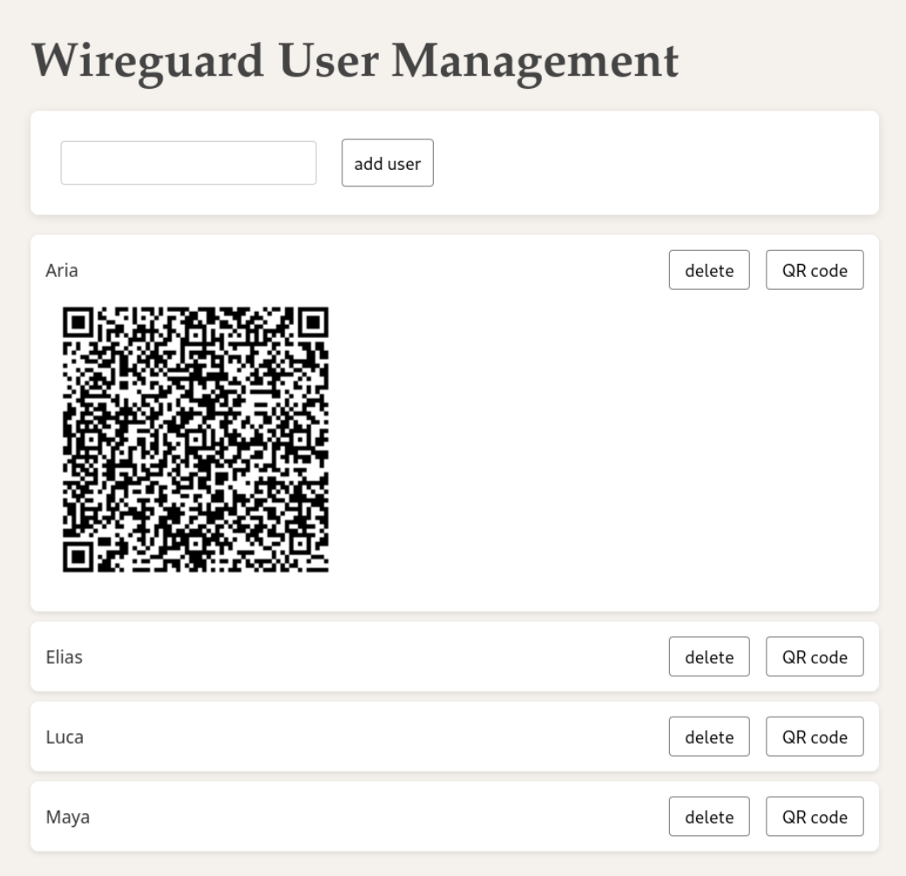

# Simple Wireguard

## Description

Easily set up a Wireguard server in a Docker container along with a user management dashboard.

This project uses a modified Wireguard Docker image from [LinuxServer](https://www.gnu.org/licenses/gpl-3.0.html) and the Python http.server library.

It is intended to be used in trusted environments only as every new user will have full access to the web dashboard and can therefore add and delete users. You can disable dashboard access from the VPN subnet by setting PROXY to false. See [Configuration](#configuration) for instructions.




## Quick Start

Copy the following to your terminal to run the Docker container and dashboard out of the box:
```
sudo apt update
sudo apt -y install docker.io python3
sudo gpasswd -a $(whoami) docker
git clone https://github.com/n0m1x/simple-wireguard
cd simple-wireguard
docker build --no-cache --pull -t simple-wireguard .
python3 wg-up.py
```
Change the Wireguard IP address in wg-up.py to make Wireguard publicly accessible.

The dashboard is only accessible from within the VPN subnet and from all connected clients by default.


## Usage

### Requirements

This project was tested on a debian system and requires the following packages: `docker.io python3`.

Make sure the user you intend to run this script with is in the Docker group (`sudo gpasswd -a $(whoami) docker`) or is otherwise permitted to run Docker commands.


### Installation

Download the repository from GitHub and build the docker image:
```
git clone https://github.com/n0m1x/simple-wireguard
cd simple-wireguard
docker build --no-cache --pull -t simple-wireguard .
```
To make the Wireguard service accessible on the internet change the default IP from 127.0.0.1 to the public IP of your server. This will be the IP that Wireguard peers connect to. You can find this and other options directly in the wg-up.py script. Running it will start the Docker container and the web dashboard.

Start the service with `./wg-up.py`.


### Getting Initial Access

To continue with adding users to Wireguard initial access to the dashboard is required. It can be accessed in a web browser locally on your server or from another device connected to the VPN with the default admin user (if PROXY is set to true which is the default). You can use the second method if your server does not have a GUI.

**Locally**

If you have access to a GUI and web browser visit http://127.0.0.1 in your browser. When more users are added they will also have access to the web dashboard from their clients.

**Via Another Device**

If you cannot access the web dashboard via browser because you do not have a desktop environment use `docker logs wireguard`. When the Docker image is started for the first time it prints the QR code which can be shown using this command. Scan it with a mobile client to connect to the VPN and access the dashboard under http://wireguard.local. From there you can add more users who will also have access to the web dashboard when connected to the VPN.


### Configuration

The Wireguard and HTTP server can be configured via the parameters at the beginning of the wg-up.py script. The following options are available.

**Options Reference Table**

| Option       | Default Value      | Description |
|--------------|-------------------|-------------|
| PROXY        | True              | Set to true to make user management web interface available in the Wireguard subnet. If False, it will only be available where it is published via the HTTP_IP option. |
| WG_IP        | 127.0.0.1         | Publishing IP for the Wireguard service. |
| PEERS_PATH   | ./peers.txt       | Text file containing the list of Wireguard users. |
| WG_CONFIG_PATH | ./config        | Directory where the Wireguard server and peer configuration is stored. |
| DOMAIN_NAME  | wireguard.local   | Domain name to access the web server from the VPN subnet (used only when PROXY is true). |
| HTTP_IP      | 127.0.0.1         | Publishing IP address for the web server. If a public IP or 0.0.0.0 is entered, it will be publicly accessible. If 127.0.0.1 or localhost is entered, it will only be available locally and optionally in the Wireguard subnet. |

You can find the full configuration for the Wireguard server further below in the same file in the `docker run` command-line options.


## FAQ

- Can the web dashboard be accessed from outside the VPN subnet?

This depends on the IP address you assigned to the HTTP_IP variable. Setting it to 0.0.0.0 will possibly make the dashboard public on the internet which is not advised. Instead, set PROXY to true and HTTP_IP to 127.0.0.1 to only allow access from VPN peers which are actively connected and localhost. If you only want to access it locally set PROXY to false and HTTP_IP to 127.0.0.1.

- How do I add or remove users?

Users can be managed through the web dashboard. If needed, you can manually edit the peers.txt file and restart the container.

- How can I change the IP range for the VPN subnet?

The VPN subnet can be changed in the `docker run` command-line options inside the wg-up.py script. If you are using the proxy (PROXY is set to true) the change needs to be reflected in the DNS entry for the coredns/Corefile further below. Make sure to enter the right IP address of the server inside the VPN subnet (by default 10.13.13.1).

- Can the service be stopped and later restarted?

Yes. The docker container will keep running in the background when the web server is terminated. The Wireguard configuration including users is preserved and active when started again.

- How do I stop and remove the service completely?

Stop the container with `docker stop simple-wireguard` and remove it with `docker rm simple-wireguard`. Optionally you can remove the generated Docker image with `docker rmi simple-wireguard`.

## Credits
LinuxServer WireGuard Docker image: https://github.com/linuxserver/docker-wireguard/tree/master

## License
Distributed under the [GNU General Public License v3.0](https://www.gnu.org/licenses/gpl-3.0.html). See LICENSE for more information.
